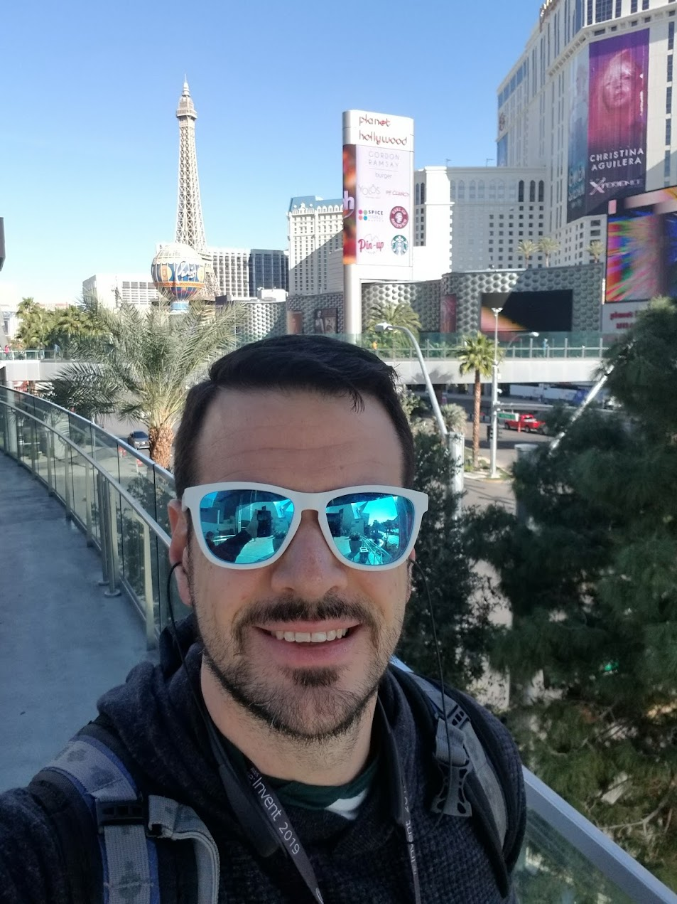

<!-- Improved compatibility of back to top link: See: https://github.com/othneildrew/Best-README-Template/pull/73 -->

<!--
*** Thanks for checking out the Best-README-Template. If you have a suggestion
*** that would make this better, please fork the repo and create a pull request
*** or simply open an issue with the tag "enhancement".
*** Don't forget to give the project a star!
*** Thanks again! Now go create something AMAZING! :D
-->

<!-- PROJECT SHIELDS -->
<!--
*** I'm using markdown "reference style" links for readability.
*** Reference links are enclosed in brackets [ ] instead of parentheses ( ).
*** See the bottom of this document for the declaration of the reference variables
*** for contributors-url, forks-url, etc. This is an optional, concise syntax you may use.
*** https://www.markdownguide.org/basic-syntax/#reference-style-links
-->

[![Forks][forks-shield]][forks-url]
[![Stargazers][stars-shield]][stars-url]
[![Issues][issues-shield]][issues-url]
[![Mastadon][Mastadon-shield]][Mastadon-url]

<!-- PROJECT LOGO -->
 

    
  

  <H3> Binary Classification of Smoking</h3>

  
 using binary classification to predict a patient's smoking status given information about various other health indicators.

<!-- TABLE OF CONTENTS -->

  
Table of Contents

  <ol>
    <li><a href="#about-the-project">About The Project</a>
    <li><a href="#built-with">Built With</a></li>
    <li><a href="#roadmap">Roadmap</a></li>
    <li><a href="#contact">Contact</a></li>
    <li><a href="#acknowledgments">Acknowledgments</a></li>
  </ol>

<!-- ABOUT THE PROJECT -->
## About The Project

Kaggle is a website where Data Scientists can participate in competitions, placing their skills against a problem; defining a techical solution (model) utilizing datasets made available via the site.

Many of these competitions have cash rewards, but some of them are done just for experience.  This particular submissions is one of them.

(<a href="#readme-top">back to top</a>)

### Built With

This section should list any major frameworks/libraries used to bootstrap your project. Leave any add-ons/plugins for the acknowledgements section. Here are a few examples.

* [![Python][python-badge]][python-url]
* [![Scikit Learn][scikit-learn-badge]][sklearn-url]

(<a href="#readme-top">back to top</a>)

<!-- GETTING STARTED -->

<!-- ROADMAP -->
## Roadmap

This project was completed as part of a competition which has completed.

(<a href="#readme-top">back to top</a>)

<!-- CONTRIBUTING -->

<!-- CONTACT -->
## Contact

Luis Banuls - [@Mastadon](https://mastodon.social/@LuisBanuls) - lbanuls@gmail.com

Project Link: [https://github.com/lbanuls/ml-smoking](https://github.com/lbanuls/ml-smoking)

(<a href="#readme-top">back to top</a>)

<!-- ACKNOWLEDGMENTS -->
## Acknowledgments

<!-- MARKDOWN LINKS & IMAGES -->
<!-- https://www.markdownguide.org/basic-syntax/#reference-style-links -->
[kaggle-competition]: https://www.kaggle.com/competitions/playground-series-s3e24
[contributors-shield]: https://img.shields.io/github/contributors/othneildrew/Best-README-Template.svg?style=for-the-badge
[python-url]: https://www.python.org/psf-landing/
[python-badge]: https://img.shields.io/badge/python-blue
[sklearn-url]: https://scikit-learn.org/stable/modules/classes.html
[scikit-learn-badge]: https://img.shields.io/badge/sklearn-orange
[forks-shield]: https://img.shields.io/github/forks/lbanuls/ml-smoking
[forks-url]: https://github.com/lbanuls/ml-smoking/forks
[stars-shield]: https://img.shields.io/github/stars/lbanuls/ml-smoking
[stars-url]: https://github.com/lbanuls/ml-smoking/stars
[issues-shield]: https://img.shields.io/github/issues/lbanuls/ml-smoking
[issues-url]: https://github.com/lbanuls/ml-smoking/issues
[mastadon-shield]: https://img.shields.io/badge/Mastadon-purple
[mastadon-url]: https://mastodon.social/home

